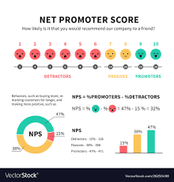

# Net Promotor Score

## Background on NPS

"Every summer, Make School welcomes hundreds of students into the Summer Academy to study software development and build cool stuff. The management wants to make sure that students continue to be satisfied with their experience as the program scales. The main way we measure this is through Net Promoter Score (NPS), which is a tool commonly used to measure customer loyalty and promotion. You’ve seen NPS before if you’ve been asked a question like:
“On a scale of 1 to 10, how likely are you to recommend [X] to a friend or colleague?”

NPS segments all responses between 1 and 10 into three categories based on their sentiment:
Promoter (9 – 10)
Passive (7 – 8)
Detractor (1 – 6)

To calculate NPS, companies follow these steps:
Segment all responses into Promoter, Passive, and Detractor categories.
Calculate the percentage of responses in each category out of the total number of responses to the survey.
Subtract the Detractors percentage from the Promoters percentage. This is the NPS.

In other words, NPS can be calculated with this equation:
`NPS = (Promoters - Detractors)  (Promoters + Passives + Detractors)`

NPS can range from –100 (if everyone is a detractor) to +100 (if everyone is a promoter)."